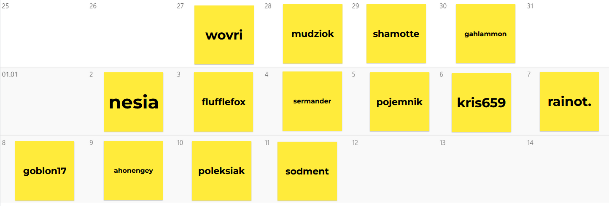

# Gra Wieloosobowa

Hejka wszystkim witam tych na którzy zgłosili się na event Gra Wieloosobowa. Dzięki że tak wielu z was wyraziło chęć wzięcia udziału! Poniżej przedstawiam umiarkowanie sformalizowane zasady i kalendarz wylosowanych dni

### Zasady eventu:

- Nie komunikujemy się z innymi uczestnikami zabawy na temat tworzonej w ramach eventu gry aż do jego zakończenia
- Pracujemy tylko w dzień przypisany do nas od 00:00 do 24:00, gdyby ktoś wrzucił zmianę po 24 to nic się raczej nie stanie nie zakładam że kolejna osoba nie zaczyna zapierdalać punkt północ
- Pracę z naszego dnia udostępniamy jako pull request na repozytorium: https://github.com/mudziok/rpg-multiplayer-event, postaram się codziennie mergować z rana ten request do maina żebście mieli pewność, żę nikt nie schował w kodzie watykańczyka ale gdybym zapomniał dać merge to śmiało bierzcie branch poprzedniej osoby jako bazę do waszej pracy (btw. jak ktoś nie ogarnia gita to pomogę)
- Do następnej osoby przekazujemy projekt który koniecznie się buduje. Radzę też jak kończycie swój dzień zamieszczać wasze zmiany jako w miarę kompletne a nie doszczętnie rozgrzebane żeby dało się to jakoś ogarnąć.
- Mimo, że bardzo nie chcę wpływać na efekt końcowy WYMAGAM żeby w grę dało się zagrać z przeglądarki w trosce żeby jak najwięcej osób mogło w naszą grę zagrać.
- Korzystamy tylko z assetów wykonanych własnoręcznie lub na licencji Creative Commons 0

Zakładam że jak ktoś nie informacji sprzeciwu to dzień mu pasuje. Jeśli macie jakieś pytanie niezwiązane z tworzoną grą a bezpośrednio z eventem to zapraszam do zadawania ich tutaj.

### FAQ:

**Nie pasuje mi dzień który mi się wylosował :'(**

Napisz tutaj na kanale, może ktoś będzie chętny się zamienić albo wybierz dzień z kalendarza który jest wolny. W kalendarzu zostawiłem jako wolne sylwester i nowy rok bo zakładam że nikt nie będzie wtedy dostępny. Tym samym jeśli komuś bez różnicy jest zamiana dniami a komuś umożliwiło by to wzięcie udziału w evencie byłbym bardzo wdzięczny za branie pod uwagę takich próśb.

**Czy mogę korzystać z kodu/assetów które powstały przed moim dniem**

Tak, ale no w granicach rozsądku proszę nie podmieniać gry na swoją XD

Nie mogę zbudować/pracować nad grą którą dostałem od poprzedniej osoby :'(
Napisz do osoby z dnia poprzedniego i do mnie postaramy się to rozwiązać.

**Ile czasu powinienem poświęcić na pracę?**

Projektując event zakładałem że każdy włoży w projekt tak z 3-4 godziny ale nie ma do tego wymogu, możesz poświęcić na pracę tyle czasu ile zechcesz byleby zmieściło się to w 24 godzinnym okienku twojego dnia

### Kalendarz

zmiana w innym pliku
